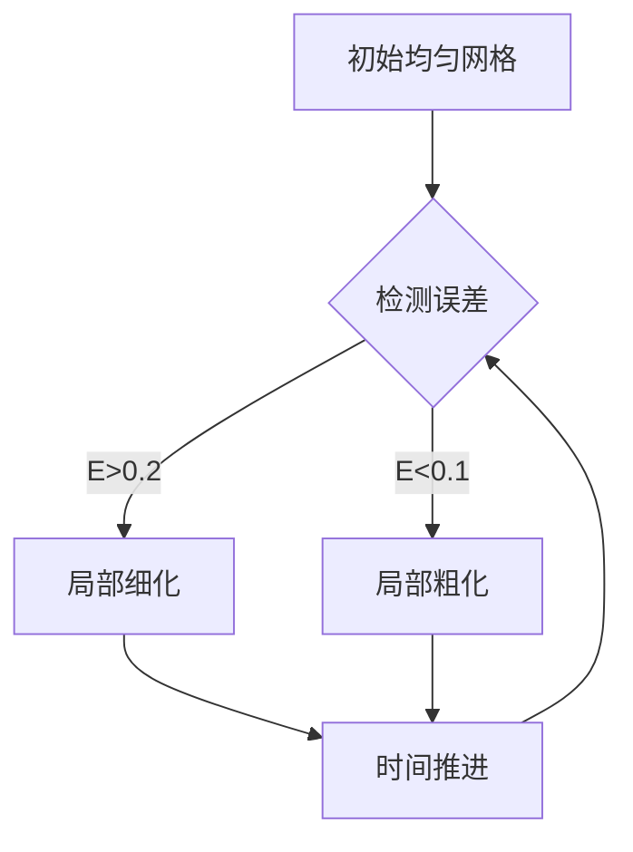

# MPI-AMRVAC 自适应网格系统详解

## 1. AMR层次结构
- **基础网格**：64×64 (domain_nx1 × domain_nx2)
- **最大细化等级**：4 (refine_max_level)
- 每级细化将网格分辨率提高2倍

## 2. 网格细化判据 (refine_criterion=3)

### 变量权重分配
```fortran
w_refine_weight(1)=0.4d0  ! 密度(ρ)
w_refine_weight(5)=0.3d0  ! 压强(p)
w_refine_weight(6)=0.3d0  ! 磁场能量(B²/2)
```

### 误差估计方法
1. 计算每个变量的归一化梯度：
   ```math
   E_i = \frac{|\nabla U_i| \cdot \Delta x}{U_{i,max} - U_{i,min}}
   ```
2. 加权组合：
   ```math
   E_{total} = 0.4E_\rho + 0.3E_p + 0.3E_B
   ```

## 3. 细化/粗化控制

### 细化条件 (refine_threshold=0.2)
```math
E_{total} > 0.2 \Rightarrow \text{网格细化}
```

### 粗化条件 (derefine_ratio=0.1)
```math
E_{total} < 0.1 \Rightarrow \text{网格粗化}
```

## 4. GEM重联问题的AMR策略

### 重点关注区域
1. 电流片中心区域
2. 磁场梯度大的区域
3. 等离子体流动剪切区

### 动态调整过程


## 5. 参数调优建议

1. **权重调整**：
   - 增加磁场权重：捕捉更精细的电流片结构
   - 增加密度权重：更好分辨密度梯度

2. **阈值调整**：
   - 降低阈值：更激进的细化（更高分辨率但更耗时）
   - 提高阈值：更保守的细化（更快但可能丢失细节）

3. **典型设置组合**：
```fortran
&meshlist
    refine_max_level = 5       ! 增加最大细化等级
    w_refine_weight(1)=0.5d0  ! 强调密度变化
    refine_threshold=0.15d0   ! 更易触发细化
/
```
