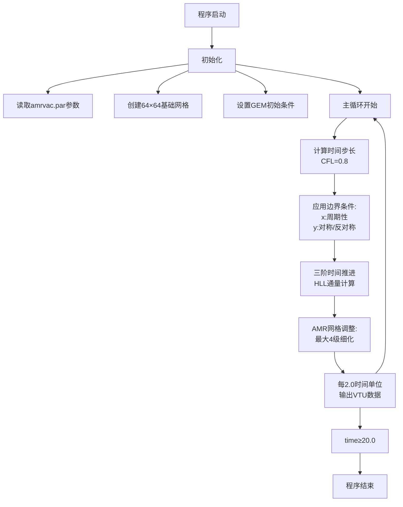

# MPI-AMRVAC 程序架构与流程分析

## 1. 程序架构概述

MPI-AMRVAC 是一个并行自适应网格磁流体动力学(MHD)模拟框架，主要特点包括：
- 采用Fortran编写，使用MPI进行并行计算
- 支持自适应网格细化(AMR)
- 包含多种物理模型和数值方法
- 模块化设计，便于扩展

## 2. 主要模块分类

### 核心模块
- `mod_amrvac`: 主程序模块
- `mod_advance`: 时间推进控制
- `mod_global_parameters`: 全局参数定义
- `mod_connectivity`: 网格连接关系
- `mod_physicaldata`: 物理数据存储

### 物理模型
- `mod_mhd`: 磁流体动力学核心
- `mod_physics`: 基础物理运算
- `mod_physics_hllc/ppm/roe`: 不同数值格式实现
- `mod_gravity`: 引力计算
- `mod_thermal_conduction`: 热传导模型

### 数值方法
- `mod_weno`: WENO格式
- `mod_ppm`: PPM重构
- `mod_limiter`: 限制器
- `mod_finite_volume`: 有限体积法

### 网格管理
- `mod_forest`: 网格树结构
- `mod_amr_fct`: AMR相关函数
- `mod_coarsen_refine`: 网格粗化/细化
- `mod_ghostcells_update`: 幽灵单元更新

### 输入输出
- `mod_input_output`: 数据读写
- `mod_convert`: 数据格式转换

## 3. 关键程序/函数

1. **初始化阶段**
   - `amrini()`: 程序初始化
   - `mod_initialize%init()`: 物理量初始化
   - `set_B0()`: 背景磁场设置

2. **主循环**
   - `mod_advance%advance()`: 时间推进主函数
   - `setdt()`: 计算时间步长
   - `errest()`: 误差估计(用于AMR)

3. **物理计算**
   - `mod_mhd%mhd_to_conserved()`: 变量转换
   - `mod_physics%get_flux()`: 通量计算
   - `mod_physics%add_source()`: 源项处理

4. **边界条件**
   - `boundary_conditions()`: 边界处理主函数
   - `mod_bc_data`: 边界条件数据

## 4. 主要执行流程与参数配置

### 4.1 核心参数配置
- **时间推进**:
  - 方法: 'threestep'三阶时间积分
  - CFL数: 0.8 (typecourant='maxsum')
  - 最小时间步: 1e-6 (dtmin)
  - 最大模拟时间: 20.0 (time_max)

- **数值格式**:
  - 通量计算: HLL格式 (flux_scheme)
  - 限制器: CADA3 (limiter)
  - 慢启动步数: 10 (slowsteps)

- **网格配置**:
  - 基础网格: 64×64 (domain_nx1/2)
  - 计算域: x∈[-12.8,12.8], y∈[-6.4,6.4]
  - AMR设置:
    - 最大细化等级: 4
    - 细化权重: ρ(0.4), p(0.3), B(0.3)
    - 细化阈值: 0.2
    - 粗化比率: 0.1

- **边界条件**:
  - x方向: 周期性边界
  - y方向: 
    - 速度/磁场: 对称边界
    - 电流密度: 反对称边界

- **输出控制**:
  - 输出格式: VTU并行格式 (convert_type='vtuBmpi')
  - 数据保存间隔: 2.0 (dtsave_dat)
  - 日志输出间隔: 100步 (ditsave_log)

### 4.2 执行流程图

### 4.3 典型时间步详细流程
1. **时间步控制**:
   - 计算CFL条件确定步长(基于最大波速和0.8的安全系数)
   - 慢启动阶段前10步使用较小时间步

2. **边界处理**:
   - x方向应用周期性边界
   - y方向应用对称/反对称组合边界

3. **物理量推进**:
   - 使用三阶时间积分方法
   - 采用HLL格式计算数值通量
   - 应用CADA3限制器抑制数值振荡

4. **网格调整**:
   - 基于密度(权重0.4)、压强(0.3)和磁场(0.3)进行误差估计
   - 当局部误差>0.2时触发网格细化
   - 当局部误差<0.1时触发网格粗化

5. **数据输出**:
   - 每2.0个时间单位保存VTU格式数据
   - 每100步输出日志信息
   - 自动转换数据格式便于可视化
