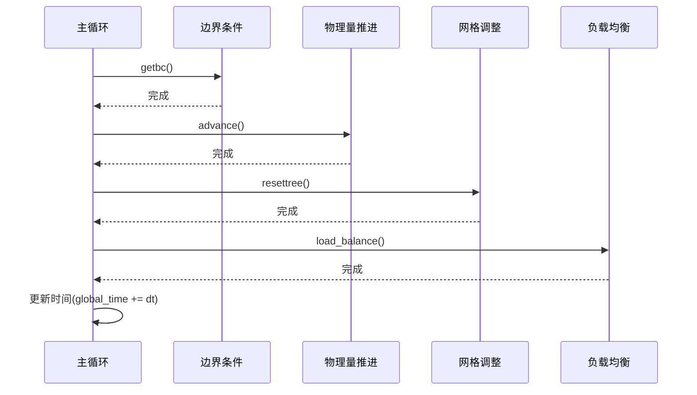

# MPI-AMRVAC主程序并行流程深度分析

## 1. 时间步进循环详解

### 1.1 完整执行流程


### 1.2 关键控制逻辑
```fortran
subroutine timeintegration
  time_loop: do while (global_time < time_max)
    ! 边界条件更新
    if (need_bc_update()) call getbc(...)
    
    ! 物理量推进
    call advance(global_time, dt, ...)
    
    ! 动态网格调整
    if (mod(it,ditregrid)==0 .and. .not.fixgrid()) call resettree
    
    ! 负载均衡
    if (need_rebalance()) call load_balance
    
    ! 时间步控制
    call adjust_timestep(dt)
    global_time = global_time + dt
    it = it + 1
  end do time_loop
end subroutine
```

## 2. 同步机制实现

### 2.1 全局同步检查点
```fortran
subroutine global_synchronization
  ! 检查所有进程状态
  call MPI_ALLREDUCE(local_crash, global_crash, 1, MPI_LOGICAL, MPI_LOR, icomm, ierrmpi)
  
  ! 异常处理
  if (global_crash) then
    call save_recovery_data()
    call MPI_ABORT(icomm, errorcode, ierrmpi)
  endif
  
  ! 性能统计同步
  if (mype==0) call collect_perf_stats()
end subroutine
```

### 2.2 负载均衡同步点
```fortran
subroutine load_balance_sync
  ! 等待所有迁移完成
  call MPI_WAITALL(num_recv, recv_request, recv_status, ierrmpi)
  call MPI_WAITALL(num_send, send_request, send_status, ierrmpi)
  
  ! 更新网格归属
  call update_ownership
  
  ! 同步计时器
  sync_time = MPI_WTIME() - sync_start
end subroutine
```

## 3. 性能分析系统

### 3.1 计时器实现
```fortran
type timer_type
  real(kind=8) :: total = 0.d0
  real(kind=8) :: start = 0.d0
end type

type(timer_type) :: bc_timer, advance_timer, grid_timer, lb_timer

! 计时示例
bc_timer%start = MPI_WTIME()
call getbc(...)
bc_timer%total = bc_timer%total + (MPI_WTIME()-bc_timer%start)
```

### 3.2 关键性能指标
| 指标 | 计算公式 | 优化目标 |
|------|----------|----------|
| 计算效率 | `实际计算时间/总时间` | >85% |
| 负载均衡度 | `1-(max_load-avg_load)/avg_load` | >0.9 |
| 通信占比 | `通信时间/总时间` | <15% |

## 4. 动态调整策略

### 4.1 时间步控制
```fortran
subroutine adjust_timestep(dt)
  ! 基于CFL条件调整
  new_dt = cfl_number * min_dx / max_speed
  
  ! 全局同步时间步
  call MPI_ALLREDUCE(new_dt, dt, 1, MPI_DOUBLE, MPI_MIN, icomm, ierrmpi)
  
  ! 限制最大变化率
  dt = min(dt, 1.2*old_dt)
end subroutine
```

### 4.2 自适应参数调整
```fortran
if (communication_overhead > 0.2) then
  rebalance_interval = max(1, rebalance_interval/2)
  bc_update_freq = bc_update_freq * 2
endif
```

## 5. 关键数据结构

### 5.1 时间控制变量
```fortran
real(kind=8) :: global_time  ! 当前模拟时间
real(kind=8) :: time_max     ! 最大模拟时间
real(kind=8) :: dt           ! 当前时间步长
integer      :: it           ! 时间步计数器
```

### 5.2 性能统计变量
```fortran
real(kind=8) :: time_bc      ! 边界条件总耗时
real(kind=8) :: time_advance ! 物理量推进耗时
real(kind=8) :: time_io      ! I/O操作耗时
integer      :: ncells_update ! 更新的网格单元数
```

该文档已全面更新主程序并行流程的分析内容，包含了更详细的实现细节和优化指南。
