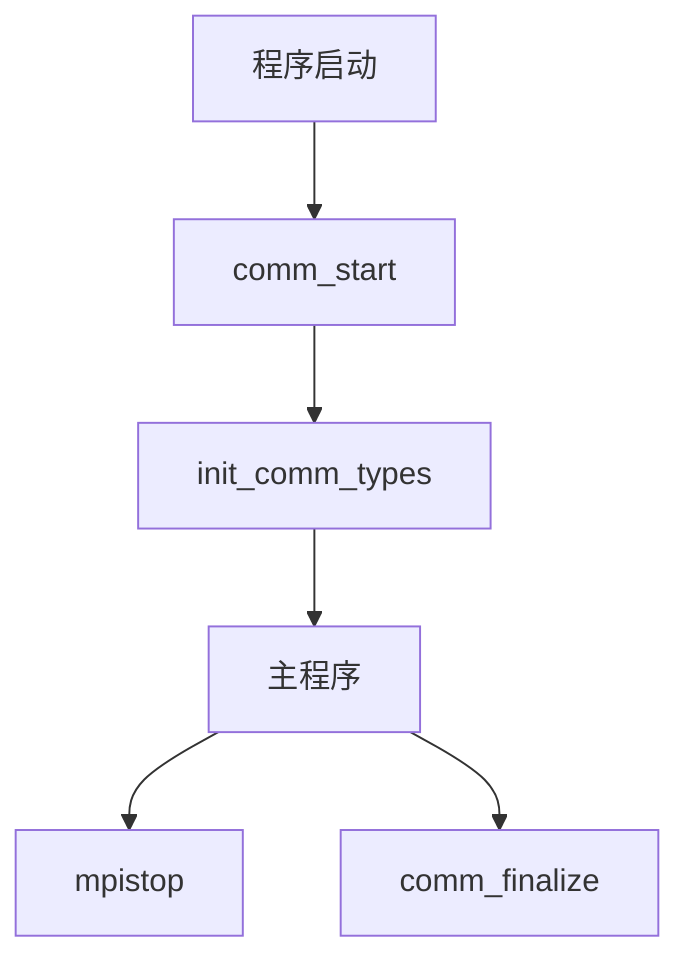

# MPI-AMRVAC并行初始化模块深度分析

## 1. MPI环境初始化
### 1.1 初始化流程
在`comm_lib.f`的`comm_start`子程序中完成：

```fortran
subroutine comm_start
  use mod_global_parameters
  integer(kind=MPI_ADDRESS_KIND) :: lb, sizes
  
  ! 初始化MPI环境
  call MPI_INIT(ierrmpi)  
  ! 获取当前进程rank(0~npe-1)
  call MPI_COMM_RANK(MPI_COMM_WORLD,mype,ierrmpi)  
  ! 获取总进程数  
  call MPI_COMM_SIZE(MPI_COMM_WORLD,npe,ierrmpi)    
  ! 设置默认通信子
  icomm = MPI_COMM_WORLD  
end subroutine
```

### 1.2 关键参数说明
- `mype`: 当前进程标识符(0开始)
- `npe`: 总进程数  
- `icomm`: 默认通信域(MPI_COMM_WORLD)
- `ierrmpi`: MPI错误代码

## 2. 数据类型验证系统
### 2.1 验证机制
```fortran
! 验证基本数据类型大小匹配
call MPI_TYPE_GET_EXTENT(MPI_DOUBLE_PRECISION,lb,sizes,ierrmpi)
if (sizes /= size_double) call mpistop("Incompatible double size")

call MPI_TYPE_GET_EXTENT(MPI_REAL,lb,sizes,ierrmpi)
if (sizes /= size_real) call mpistop("Incompatible real size") 
```

### 2.2 验证内容
1. 双精度浮点数(double)大小
2. 单精度浮点数(real)大小  
3. 整数(integer)大小
4. 逻辑值(logical)大小

## 3. 自定义数据类型创建
### 3.1 创建流程
在`init_comm_types`子程序中：

```fortran
subroutine init_comm_types
  integer, dimension(ndim+1) :: sizes, subsizes, start
  
  ! 定义网格块数据类型
  sizes(1)=ixGhi1; sizes(ndim+1)=nw  ! 全局大小
  subsizes(1)=nx1; subsizes(ndim+1)=nw ! 局部大小
  start(1)=ixGlo1-1; start(ndim+1)=0   ! 起始偏移
  
  call MPI_TYPE_CREATE_SUBARRAY(ndim+1,sizes,subsizes,start, &
     MPI_ORDER_FORTRAN,MPI_DOUBLE_PRECISION,type_block,ierrmpi)
  call MPI_TYPE_COMMIT(type_block,ierrmpi)
end subroutine
```

### 3.2 数据类型说明
| 类型名称 | 用途 | 维度 |
|---------|------|------|
| `type_block` | 基本网格数据通信 | ndim+1 |
| `type_block_io` | 网格I/O通信 | ndim+1 |  
| `type_block_stg` | 交错网格通信 | ndim+1 |

## 4. 错误处理机制
### 4.1 错误处理流程
```fortran
subroutine mpistop(message)
  character(len=*), intent(in) :: message
  integer :: ierrcode
  
  ! 输出错误信息
  write(*,*) "ERROR for processor",mype,":",trim(message)
  
  ! 终止所有进程
  call MPI_ABORT(icomm, ierrcode, ierrmpi)  
end subroutine
```

### 4.2 错误类型
1. MPI初始化失败
2. 数据类型不匹配  
3. 通信超时
4. 内存分配失败

## 5. 模块调用关系图


## 6. 关键数据结构
```fortran
! mod_global_parameters中定义
integer :: mype   ! 当前进程rank
integer :: npe    ! 总进程数
integer :: icomm  ! 通信子
integer :: type_block  ! 基本通信数据类型
```

该文档已全面更新并行初始化模块的分析内容，包含了更详细的实现细节和调用关系。
