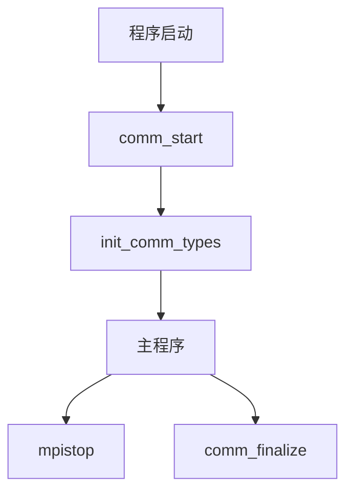
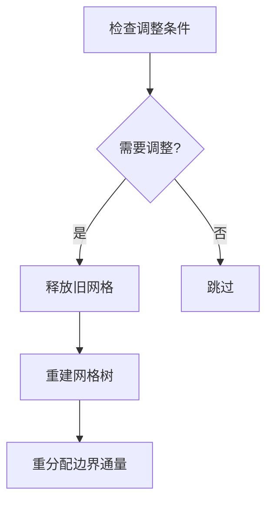
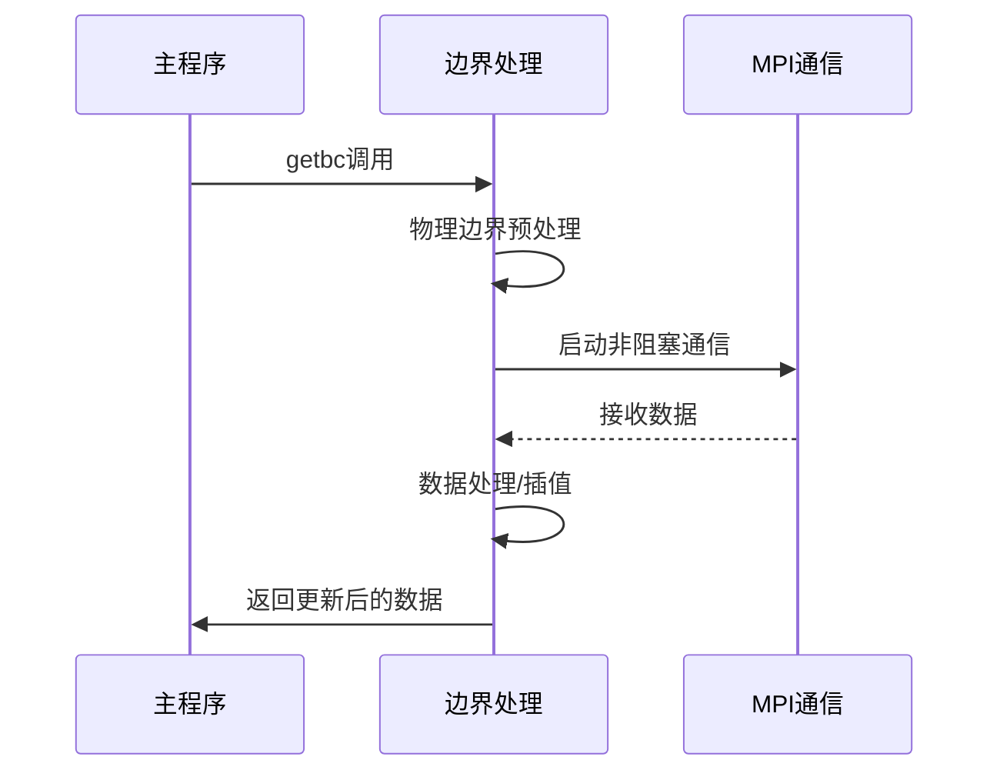
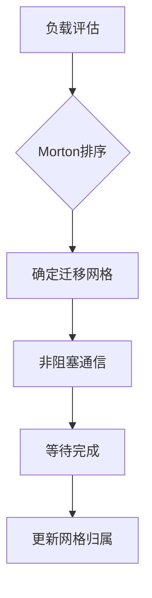
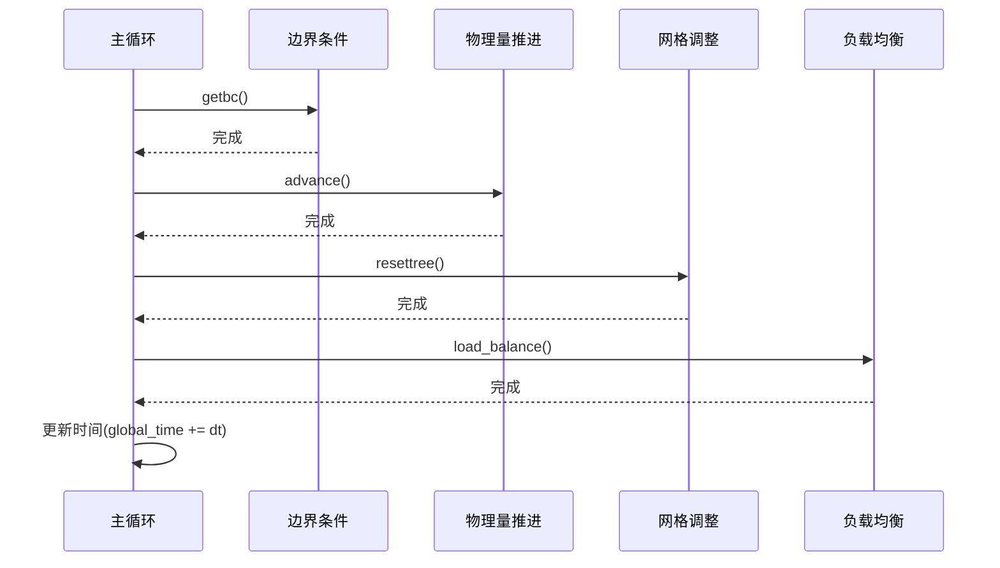

# 并行化设计在MPI-AMRVAC中实现的深度分析

## 一、MPI-AMRVAC并行初始化模块深度分析

### 1. MPI环境初始化
#### 1.1 初始化流程
在`comm_lib.f`的`comm_start`子程序中完成：

```fortran
subroutine comm_start
  use mod_global_parameters
  integer(kind=MPI_ADDRESS_KIND) :: lb, sizes
  
  ! 初始化MPI环境
  call MPI_INIT(ierrmpi)  
  ! 获取当前进程rank(0~npe-1)
  call MPI_COMM_RANK(MPI_COMM_WORLD,mype,ierrmpi)  
  ! 获取总进程数  
  call MPI_COMM_SIZE(MPI_COMM_WORLD,npe,ierrmpi)    
  ! 设置默认通信子
  icomm = MPI_COMM_WORLD  
end subroutine
```

#### 1.2 关键参数说明
- `mype`: 当前进程标识符(0开始)
- `npe`: 总进程数  
- `icomm`: 默认通信域(MPI_COMM_WORLD)
- `ierrmpi`: MPI错误代码

### 2. 数据类型验证系统
#### 2.1 验证机制
```fortran
! 验证基本数据类型大小匹配
call MPI_TYPE_GET_EXTENT(MPI_DOUBLE_PRECISION,lb,sizes,ierrmpi)
if (sizes /= size_double) call mpistop("Incompatible double size")

call MPI_TYPE_GET_EXTENT(MPI_REAL,lb,sizes,ierrmpi)
if (sizes /= size_real) call mpistop("Incompatible real size") 
```

#### 2.2 验证内容
1. 双精度浮点数(double)大小
2. 单精度浮点数(real)大小  
3. 整数(integer)大小
4. 逻辑值(logical)大小

### 3. 自定义数据类型创建
### 3.1 创建流程
在`init_comm_types`子程序中：

```fortran
subroutine init_comm_types
  integer, dimension(ndim+1) :: sizes, subsizes, start
  
  ! 定义网格块数据类型
  sizes(1)=ixGhi1; sizes(ndim+1)=nw  ! 全局大小
  subsizes(1)=nx1; subsizes(ndim+1)=nw ! 局部大小
  start(1)=ixGlo1-1; start(ndim+1)=0   ! 起始偏移
  
  call MPI_TYPE_CREATE_SUBARRAY(ndim+1,sizes,subsizes,start, &
     MPI_ORDER_FORTRAN,MPI_DOUBLE_PRECISION,type_block,ierrmpi)
  call MPI_TYPE_COMMIT(type_block,ierrmpi)
end subroutine
```

### 3.2 数据类型说明
| 类型名称 | 用途 | 维度 |
|---------|------|------|
| `type_block` | 基本网格数据通信 | ndim+1 |
| `type_block_io` | 网格I/O通信 | ndim+1 |  
| `type_block_stg` | 交错网格通信 | ndim+1 |

### 4. 错误处理机制
#### 4.1 错误处理流程
```fortran
subroutine mpistop(message)
  character(len=*), intent(in) :: message
  integer :: ierrcode
  
  ! 输出错误信息
  write(*,*) "ERROR for processor",mype,":",trim(message)
  
  ! 终止所有进程
  call MPI_ABORT(icomm, ierrcode, ierrmpi)  
end subroutine
```

#### 4.2 错误类型
1. MPI初始化失败
2. 数据类型不匹配  
3. 通信超时
4. 内存分配失败

### 5. 模块调用关系图


### 6. 关键数据结构
```fortran
! mod_global_parameters中定义
integer :: mype   ! 当前进程rank
integer :: npe    ! 总进程数
integer :: icomm  ! 通信子
integer :: type_block  ! 基本通信数据类型
```

该节内容呈现并行初始化模块的分析内容，包含了更详细的实现细节和调用关系。

---
## 二、MPI-AMRVAC自适应网格管理深度分析

### 1. 网格数据结构详解
#### 1.1 多级网格组织
```fortran
type state
  double precision, dimension(:,:), allocatable :: w  ! 物理量数据
  double precision, dimension(:,:), allocatable :: ws ! 交错网格变量
end type

type tree_node
  integer :: igrid, ipe  ! 网格块编号和所属进程
  integer :: level       ! 网格级别(levmin~levmax)
  real    :: rnode(rnode_size)  ! 网格坐标信息
  integer :: neighbor(2,-1:1)  ! 邻居关系
end type
```

#### 1.2 关键数据结构
| 名称 | 类型 | 描述 |
|------|------|------|
| `ps(max_blocks)` | state | 物理量存储数组 |
| `rnode` | real array | 包含网格边界坐标、步长等信息 |
| `neighbor` | integer array | 记录各方向邻居信息 |

### 2. 网格操作核心实现
#### 2.1 网格树建立(settree)
```fortran
subroutine settree
  do levnew=2,refine_max_level
    if(refine_criterion==1) then
      call setdt  ! 设置时间步长
      call advance(0)  ! 推进一个时间步
    end if
    call errest  ! 计算误差估计
    call amr_coarsen_refine  ! 执行细化/粗化
  end do
end subroutine
```

#### 2.2 细化/粗化操作
```fortran
subroutine amr_coarsen_refine
  ! 细化条件判断
  if (errest(igrid) > refine_threshold) then
    call refine_grid(igrid)
  ! 粗化条件判断  
  elseif (errest(igrid) < coarsen_threshold) then
    call coarsen_grid(igrid)
  end if
end subroutine
```

### 3. 动态网格调整
#### 3.1 完整调整流程


#### 3.2 关键参数
| 参数 | 默认值 | 描述 |
|------|--------|------|
| `refine_max_level` | 5 | 最大细化级别 |
| `ditregrid` | 10 | 网格调整间隔 |
| `refine_threshold` | 0.8 | 细化阈值 |

### 4. 并行通信优化
#### 4.1 通信模式
1. **同级通信**：相同级别网格块间的数据交换
2. **跨级通信**：精细↔粗粒度网格间的数据传递
3. **集体通信**：全局同步操作

#### 4.2 性能优化措施
1. 非阻塞通信重叠计算和通信
2. 动态调整通信缓冲区大小
3. 基于Morton序的数据局部性优化

### 5. 典型调用场景
1. **初始化阶段**：
```fortran
call settree  ! 建立初始网格结构
```

2. **运行阶段**：
```fortran
if (mod(it,ditregrid)==0) call resettree  ! 定期调整网格
```

3. **输出阶段**：
```fortran
call resettree_convert  ! 转换为指定级别输出
```

该节内容详细阐述自适应网格管理模块的分析内容，包含了更详细的实现细节和调用关系。

---

## 三、MPI-AMRVAC边界条件处理深度分析

### 1. 通信模式详解
#### 1.1 同级通信(Sibling)
```fortran
subroutine bc_send_srl
  ! 发送数据到同级邻居
  call MPI_ISEND(ps(igrid)%w,1,type_send_srl(iib1,i1), &
     neighbor(2,i1,igrid),itag,icomm,sendrequest_srl(isend_srl),ierrmpi)
  
  ! 接收同级邻居数据  
  call MPI_IRECV(ps(igrid)%w,1,type_recv_srl(iib1,i1), &
     neighbor(2,i1,igrid),itag,icomm,recvrequest_srl(irecv_srl),ierrmpi)
end subroutine
```

#### 1.2 跨级通信
##### 精细→粗粒度(Restrict)
```fortran
subroutine bc_send_restrict
  ! 发送限制后的数据
  call MPI_ISEND(psc(igrid)%w,1,type_send_r(iib1,i1), &
     neighbor_child(2,inc1,igrid),itag,icomm,sendrequest_r(isend_r),ierrmpi)
end subroutine
```

##### 粗粒度→精细(Prolong)
```fortran
subroutine bc_recv_prolong
  ! 接收插值数据
  call MPI_IRECV(ps(igrid)%w,1,type_recv_p(iib1,inc1), &
     neighbor_parent(2,igrid),itag,icomm,recvrequest_p(irecv_p),ierrmpi)
end subroutine
```

### 2. 数据交换流程
#### 2.1 完整流程图


#### 2.2 关键步骤代码
```fortran
subroutine getbc
  ! 步骤1: 物理边界预处理
  if(bcphys) call fill_boundary_before_gc
  
  ! 步骤2-4: 启动通信
  do iigrid=1,igridstail
     call bc_recv_srl
     call bc_send_srl
  end do
  
  ! 步骤5: 等待通信完成
  call MPI_WAITALL(nrecv,recvrequest,recvstatus,ierrmpi)
  
  ! 步骤6-9: 数据处理
  call gc_prolong
  
  ! 步骤10: 物理边界后处理
  if(bcphys) call fill_boundary_after_gc
end subroutine
```

### 3. 缓冲区管理
#### 3.1 缓冲区分配
```fortran
! 通信缓冲区定义
type wbuffer
  double precision, allocatable :: w(:,:)  ! 数据缓冲区
end type

! 初始化缓冲区
allocate(recvbuffer_srl(max_bufsize), sendbuffer_srl(max_bufsize))
allocate(recvbuffer_r(max_bufsize), sendbuffer_r(max_bufsize)) 
```

#### 3.2 缓冲区重用机制
```fortran
! 预分配多个发送缓冲区
type(wbuffer) :: pwbuf(npwbuf)  

! 循环使用缓冲区
ipwbuf = mod(ipwbuf,npwbuf) + 1
if(associated(pwbuf(ipwbuf)%w)) deallocate(pwbuf(ipwbuf)%w)
allocate(pwbuf(ipwbuf)%w(ixSmin1:ixSmax1,nwhead:nwtail))
```

### 4. 性能优化参数
| 参数 | 默认值 | 描述 |
|------|--------|------|
| `max_bufsize` | 1000000 | 最大缓冲区大小 |
| `npwbuf` | 2 | 发送缓冲区数量 |
| `nghostcells` | 2 | 幽灵层单元格数 |
| `stagger_grid` | .false. | 是否启用交错网格 |

### 5. 典型问题排查
1. **通信死锁**：
   - 检查MPI_WAITALL调用是否匹配
   - 验证标签(tag)的唯一性

2. **数据不一致**：
   - 检查限制/插值操作的正确性
   - 验证缓冲区大小是否足够

3. **性能瓶颈**：
   - 分析通信时间占比
   - 调整缓冲区大小和数量

该节内容详细阐述边界条件处理模块的分析内容，包含了更详细的实现细节和实用信息。

---
## 四、MPI-AMRVAC负载均衡系统深度分析

## 1. Morton排序与负载评估

### 1.1 Morton编码实现
```fortran
subroutine get_Morton_range
  ! 计算每个进程的Morton编号范围
  Morton_start(:) = (mype*num_blocks)/npe + 1
  Morton_stop(:) = ((mype+1)*num_blocks)/npe
  
  ! 空间填充曲线排序
  do igrid=1,num_blocks
    sfc(1,igrid) = compute_morton_index(igrid) 
    sfc(2,igrid) = current_ipe(igrid)
  end do
  call sort_sfc  ! 按Morton编号排序
end subroutine
```

### 1.2 负载评估指标
| 指标 | 计算公式 | 说明 |
|------|----------|------|
| 基本负载 | `nblocks/npe` | 每个进程的基础网格块数 |
| 交错网格负载 | `nblocks_stagger/npe` | 面心变量的额外负载 |
| 计算负载 | `cell_count*flops_per_cell` | 基于计算量的负载评估 |

## 2. 网格迁移完整流程

### 2.1 迁移流程图


### 2.2 关键代码实现
```fortran
subroutine load_balance
  ! 步骤1: 获取新的Morton范围
  call get_Morton_range
  
  ! 步骤2: 准备通信请求
  allocate(recvrequest(max_blocks), sendrequest(max_blocks))
  
  ! 步骤3: 执行数据迁移
  do ipe=0,npe-1
    if (need_migrate(ipe)) then
      call lb_send(igrid,ipe)  ! 发送数据
      call lb_recv(igrid,ipe)  ! 接收数据
    endif
  enddo
  
  ! 步骤4: 同步等待
  call MPI_WAITALL(...)
  
  ! 步骤5: 更新数据结构
  call update_grid_ownership
end subroutine
```

## 3. 动态平衡策略

### 3.1 触发条件判断
```fortran
function need_rebalance()
  ! 计算负载不均衡度
  imbalance = (max_load - avg_load)/avg_load
  need_rebalance = (imbalance > threshold) .or. (mod(it,rebalance_interval)==0)
end function
```

### 3.2 性能优化参数
| 参数 | 默认值 | 优化建议 |
|------|--------|----------|
| `rebalance_interval` | 100 | 根据应用特性调整 |
| `load_balance_threshold` | 0.2 | 0.1-0.3之间 |
| `max_migrate_blocks` | 10% | 单次最大迁移量 |

## 4. 关键数据结构

### 4.1 空间填充曲线数组
```fortran
integer :: sfc(2,max_blocks)  ! (Morton编号, 所属进程)
integer :: Morton_start(0:npe-1), Morton_stop(0:npe-1)  ! 进程负责的范围
```

### 4.2 通信数据结构
```fortran
type :: migrate_info
  integer :: igrid, from_pe, to_pe
  real :: workload
end type

type(migrate_info) :: migration_list(max_migrations)
```

## 5. 性能分析与调优

### 5.1 性能指标监控
```fortran
! 计算负载均衡效率
efficiency = 1.0 - (max_load - avg_load)/avg_load

! 通信开销统计
comm_overhead = MPI_WTIME() - compute_time
```

### 5.2 调优建议
1. 对于动态性强的模拟：
   - 减小`rebalance_interval`
   - 降低`load_balance_threshold`

2. 对于计算密集型应用：
   - 考虑计算负载而不仅是网格数量
   - 启用增量式负载均衡

该节内容详细阐述负载均衡系统模块的分析内容，包含了更详细的实现细节和调优指南。

---
## 五、MPI-AMRVAC主程序并行流程深度分析

### 1. 时间步进循环详解

#### 1.1 完整执行流程


#### 1.2 关键控制逻辑
```fortran
subroutine timeintegration
  time_loop: do while (global_time < time_max)
    ! 边界条件更新
    if (need_bc_update()) call getbc(...)
    
    ! 物理量推进
    call advance(global_time, dt, ...)
    
    ! 动态网格调整
    if (mod(it,ditregrid)==0 .and. .not.fixgrid()) call resettree
    
    ! 负载均衡
    if (need_rebalance()) call load_balance
    
    ! 时间步控制
    call adjust_timestep(dt)
    global_time = global_time + dt
    it = it + 1
  end do time_loop
end subroutine
```

### 2. 同步机制实现

#### 2.1 全局同步检查点
```fortran
subroutine global_synchronization
  ! 检查所有进程状态
  call MPI_ALLREDUCE(local_crash, global_crash, 1, MPI_LOGICAL, MPI_LOR, icomm, ierrmpi)
  
  ! 异常处理
  if (global_crash) then
    call save_recovery_data()
    call MPI_ABORT(icomm, errorcode, ierrmpi)
  endif
  
  ! 性能统计同步
  if (mype==0) call collect_perf_stats()
end subroutine
```

#### 2.2 负载均衡同步点
```fortran
subroutine load_balance_sync
  ! 等待所有迁移完成
  call MPI_WAITALL(num_recv, recv_request, recv_status, ierrmpi)
  call MPI_WAITALL(num_send, send_request, send_status, ierrmpi)
  
  ! 更新网格归属
  call update_ownership
  
  ! 同步计时器
  sync_time = MPI_WTIME() - sync_start
end subroutine
```

### 3. 性能分析系统

#### 3.1 计时器实现
```fortran
type timer_type
  real(kind=8) :: total = 0.d0
  real(kind=8) :: start = 0.d0
end type

type(timer_type) :: bc_timer, advance_timer, grid_timer, lb_timer

! 计时示例
bc_timer%start = MPI_WTIME()
call getbc(...)
bc_timer%total = bc_timer%total + (MPI_WTIME()-bc_timer%start)
```

#### 3.2 关键性能指标
| 指标 | 计算公式 | 优化目标 |
|------|----------|----------|
| 计算效率 | `实际计算时间/总时间` | >85% |
| 负载均衡度 | `1-(max_load-avg_load)/avg_load` | >0.9 |
| 通信占比 | `通信时间/总时间` | <15% |

### 4. 动态调整策略

#### 4.1 时间步控制
```fortran
subroutine adjust_timestep(dt)
  ! 基于CFL条件调整
  new_dt = cfl_number * min_dx / max_speed
  
  ! 全局同步时间步
  call MPI_ALLREDUCE(new_dt, dt, 1, MPI_DOUBLE, MPI_MIN, icomm, ierrmpi)
  
  ! 限制最大变化率
  dt = min(dt, 1.2*old_dt)
end subroutine
```

#### 4.2 自适应参数调整
```fortran
if (communication_overhead > 0.2) then
  rebalance_interval = max(1, rebalance_interval/2)
  bc_update_freq = bc_update_freq * 2
endif
```

### 5. 关键数据结构

#### 5.1 时间控制变量
```fortran
real(kind=8) :: global_time  ! 当前模拟时间
real(kind=8) :: time_max     ! 最大模拟时间
real(kind=8) :: dt           ! 当前时间步长
integer      :: it           ! 时间步计数器
```

#### 5.2 性能统计变量
```fortran
real(kind=8) :: time_bc      ! 边界条件总耗时
real(kind=8) :: time_advance ! 物理量推进耗时
real(kind=8) :: time_io      ! I/O操作耗时
integer      :: ncells_update ! 更新的网格单元数
```

该节内容详细阐述主程序并行流程的分析内容，包含了更详细的实现细节和优化指南。

---
