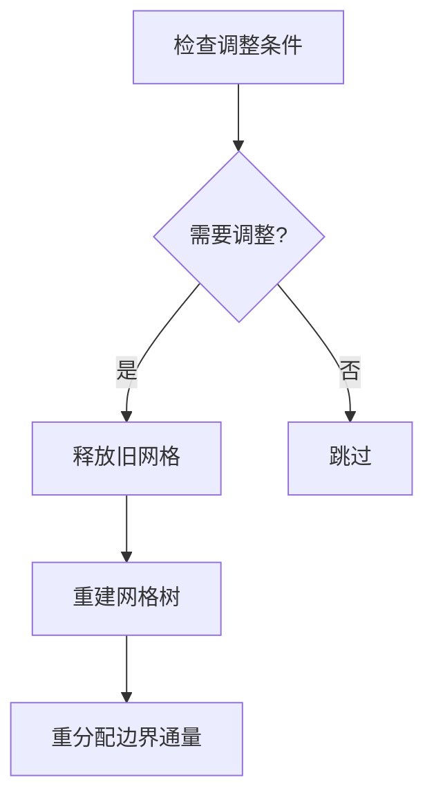

# MPI-AMRVAC自适应网格管理深度分析

## 1. 网格数据结构详解
### 1.1 多级网格组织
```fortran
type state
  double precision, dimension(:,:), allocatable :: w  ! 物理量数据
  double precision, dimension(:,:), allocatable :: ws ! 交错网格变量
end type

type tree_node
  integer :: igrid, ipe  ! 网格块编号和所属进程
  integer :: level       ! 网格级别(levmin~levmax)
  real    :: rnode(rnode_size)  ! 网格坐标信息
  integer :: neighbor(2,-1:1)  ! 邻居关系
end type
```

### 1.2 关键数据结构
| 名称 | 类型 | 描述 |
|------|------|------|
| `ps(max_blocks)` | state | 物理量存储数组 |
| `rnode` | real array | 包含网格边界坐标、步长等信息 |
| `neighbor` | integer array | 记录各方向邻居信息 |

## 2. 网格操作核心实现
### 2.1 网格树建立(settree)
```fortran
subroutine settree
  do levnew=2,refine_max_level
    if(refine_criterion==1) then
      call setdt  ! 设置时间步长
      call advance(0)  ! 推进一个时间步
    end if
    call errest  ! 计算误差估计
    call amr_coarsen_refine  ! 执行细化/粗化
  end do
end subroutine
```

### 2.2 细化/粗化操作
```fortran
subroutine amr_coarsen_refine
  ! 细化条件判断
  if (errest(igrid) > refine_threshold) then
    call refine_grid(igrid)
  ! 粗化条件判断  
  elseif (errest(igrid) < coarsen_threshold) then
    call coarsen_grid(igrid)
  end if
end subroutine
```

## 3. 动态网格调整
### 3.1 完整调整流程


### 3.2 关键参数
| 参数 | 默认值 | 描述 |
|------|--------|------|
| `refine_max_level` | 5 | 最大细化级别 |
| `ditregrid` | 10 | 网格调整间隔 |
| `refine_threshold` | 0.8 | 细化阈值 |

## 4. 并行通信优化
### 4.1 通信模式
1. **同级通信**：相同级别网格块间的数据交换
2. **跨级通信**：精细↔粗粒度网格间的数据传递
3. **集体通信**：全局同步操作

### 4.2 性能优化措施
1. 非阻塞通信重叠计算和通信
2. 动态调整通信缓冲区大小
3. 基于Morton序的数据局部性优化

## 5. 典型调用场景
1. **初始化阶段**：
```fortran
call settree  ! 建立初始网格结构
```

2. **运行阶段**：
```fortran
if (mod(it,ditregrid)==0) call resettree  ! 定期调整网格
```

3. **输出阶段**：
```fortran
call resettree_convert  ! 转换为指定级别输出
```

该文档已全面更新自适应网格管理模块的分析内容，包含了更详细的实现细节和调用关系。
