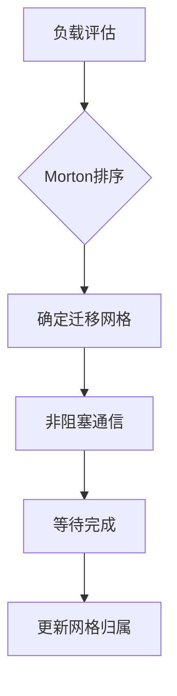

# MPI-AMRVAC负载均衡系统深度分析

## 1. Morton排序与负载评估

### 1.1 Morton编码实现
```fortran
subroutine get_Morton_range
  ! 计算每个进程的Morton编号范围
  Morton_start(:) = (mype*num_blocks)/npe + 1
  Morton_stop(:) = ((mype+1)*num_blocks)/npe
  
  ! 空间填充曲线排序
  do igrid=1,num_blocks
    sfc(1,igrid) = compute_morton_index(igrid) 
    sfc(2,igrid) = current_ipe(igrid)
  end do
  call sort_sfc  ! 按Morton编号排序
end subroutine
```

### 1.2 负载评估指标
| 指标 | 计算公式 | 说明 |
|------|----------|------|
| 基本负载 | `nblocks/npe` | 每个进程的基础网格块数 |
| 交错网格负载 | `nblocks_stagger/npe` | 面心变量的额外负载 |
| 计算负载 | `cell_count*flops_per_cell` | 基于计算量的负载评估 |

## 2. 网格迁移完整流程

### 2.1 迁移流程图


### 2.2 关键代码实现
```fortran
subroutine load_balance
  ! 步骤1: 获取新的Morton范围
  call get_Morton_range
  
  ! 步骤2: 准备通信请求
  allocate(recvrequest(max_blocks), sendrequest(max_blocks))
  
  ! 步骤3: 执行数据迁移
  do ipe=0,npe-1
    if (need_migrate(ipe)) then
      call lb_send(igrid,ipe)  ! 发送数据
      call lb_recv(igrid,ipe)  ! 接收数据
    endif
  enddo
  
  ! 步骤4: 同步等待
  call MPI_WAITALL(...)
  
  ! 步骤5: 更新数据结构
  call update_grid_ownership
end subroutine
```

## 3. 动态平衡策略

### 3.1 触发条件判断
```fortran
function need_rebalance()
  ! 计算负载不均衡度
  imbalance = (max_load - avg_load)/avg_load
  need_rebalance = (imbalance > threshold) .or. (mod(it,rebalance_interval)==0)
end function
```

### 3.2 性能优化参数
| 参数 | 默认值 | 优化建议 |
|------|--------|----------|
| `rebalance_interval` | 100 | 根据应用特性调整 |
| `load_balance_threshold` | 0.2 | 0.1-0.3之间 |
| `max_migrate_blocks` | 10% | 单次最大迁移量 |

## 4. 关键数据结构

### 4.1 空间填充曲线数组
```fortran
integer :: sfc(2,max_blocks)  ! (Morton编号, 所属进程)
integer :: Morton_start(0:npe-1), Morton_stop(0:npe-1)  ! 进程负责的范围
```

### 4.2 通信数据结构
```fortran
type :: migrate_info
  integer :: igrid, from_pe, to_pe
  real :: workload
end type

type(migrate_info) :: migration_list(max_migrations)
```

## 5. 性能分析与调优

### 5.1 性能指标监控
```fortran
! 计算负载均衡效率
efficiency = 1.0 - (max_load - avg_load)/avg_load

! 通信开销统计
comm_overhead = MPI_WTIME() - compute_time
```

### 5.2 调优建议
1. 对于动态性强的模拟：
   - 减小`rebalance_interval`
   - 降低`load_balance_threshold`

2. 对于计算密集型应用：
   - 考虑计算负载而不仅是网格数量
   - 启用增量式负载均衡

该文档已全面更新负载均衡系统模块的分析内容，包含了更详细的实现细节和调优指南。
