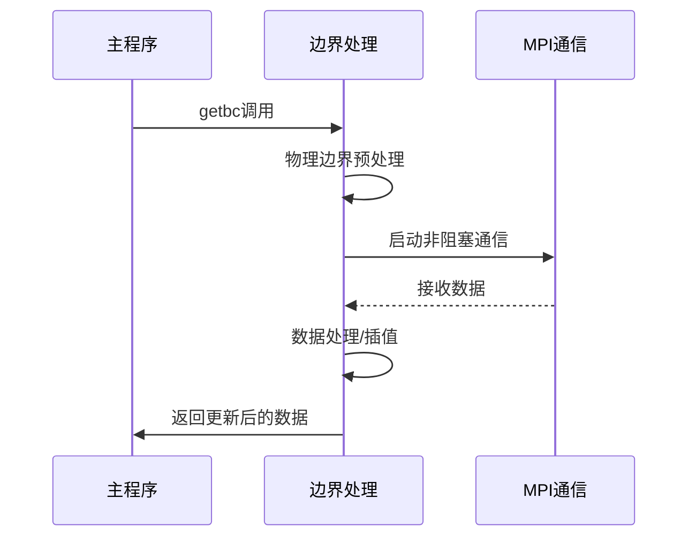

# MPI-AMRVAC边界条件处理深度分析

## 1. 通信模式详解
### 1.1 同级通信(Sibling)
```fortran
subroutine bc_send_srl
  ! 发送数据到同级邻居
  call MPI_ISEND(ps(igrid)%w,1,type_send_srl(iib1,i1), &
     neighbor(2,i1,igrid),itag,icomm,sendrequest_srl(isend_srl),ierrmpi)
  
  ! 接收同级邻居数据  
  call MPI_IRECV(ps(igrid)%w,1,type_recv_srl(iib1,i1), &
     neighbor(2,i1,igrid),itag,icomm,recvrequest_srl(irecv_srl),ierrmpi)
end subroutine
```

### 1.2 跨级通信
#### 精细→粗粒度(Restrict)
```fortran
subroutine bc_send_restrict
  ! 发送限制后的数据
  call MPI_ISEND(psc(igrid)%w,1,type_send_r(iib1,i1), &
     neighbor_child(2,inc1,igrid),itag,icomm,sendrequest_r(isend_r),ierrmpi)
end subroutine
```

#### 粗粒度→精细(Prolong)
```fortran
subroutine bc_recv_prolong
  ! 接收插值数据
  call MPI_IRECV(ps(igrid)%w,1,type_recv_p(iib1,inc1), &
     neighbor_parent(2,igrid),itag,icomm,recvrequest_p(irecv_p),ierrmpi)
end subroutine
```

## 2. 数据交换流程
### 2.1 完整流程图


### 2.2 关键步骤代码
```fortran
subroutine getbc
  ! 步骤1: 物理边界预处理
  if(bcphys) call fill_boundary_before_gc
  
  ! 步骤2-4: 启动通信
  do iigrid=1,igridstail
     call bc_recv_srl
     call bc_send_srl
  end do
  
  ! 步骤5: 等待通信完成
  call MPI_WAITALL(nrecv,recvrequest,recvstatus,ierrmpi)
  
  ! 步骤6-9: 数据处理
  call gc_prolong
  
  ! 步骤10: 物理边界后处理
  if(bcphys) call fill_boundary_after_gc
end subroutine
```

## 3. 缓冲区管理
### 3.1 缓冲区分配
```fortran
! 通信缓冲区定义
type wbuffer
  double precision, allocatable :: w(:,:)  ! 数据缓冲区
end type

! 初始化缓冲区
allocate(recvbuffer_srl(max_bufsize), sendbuffer_srl(max_bufsize))
allocate(recvbuffer_r(max_bufsize), sendbuffer_r(max_bufsize)) 
```

### 3.2 缓冲区重用机制
```fortran
! 预分配多个发送缓冲区
type(wbuffer) :: pwbuf(npwbuf)  

! 循环使用缓冲区
ipwbuf = mod(ipwbuf,npwbuf) + 1
if(associated(pwbuf(ipwbuf)%w)) deallocate(pwbuf(ipwbuf)%w)
allocate(pwbuf(ipwbuf)%w(ixSmin1:ixSmax1,nwhead:nwtail))
```

## 4. 性能优化参数
| 参数 | 默认值 | 描述 |
|------|--------|------|
| `max_bufsize` | 1000000 | 最大缓冲区大小 |
| `npwbuf` | 2 | 发送缓冲区数量 |
| `nghostcells` | 2 | 幽灵层单元格数 |
| `stagger_grid` | .false. | 是否启用交错网格 |

## 5. 典型问题排查
1. **通信死锁**：
   - 检查MPI_WAITALL调用是否匹配
   - 验证标签(tag)的唯一性

2. **数据不一致**：
   - 检查限制/插值操作的正确性
   - 验证缓冲区大小是否足够

3. **性能瓶颈**：
   - 分析通信时间占比
   - 调整缓冲区大小和数量

该文档已全面更新边界条件处理模块的分析内容，包含了更详细的实现细节和实用信息。
