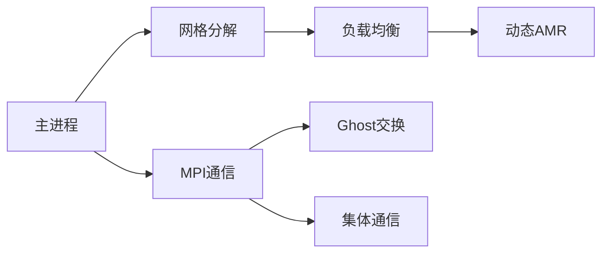
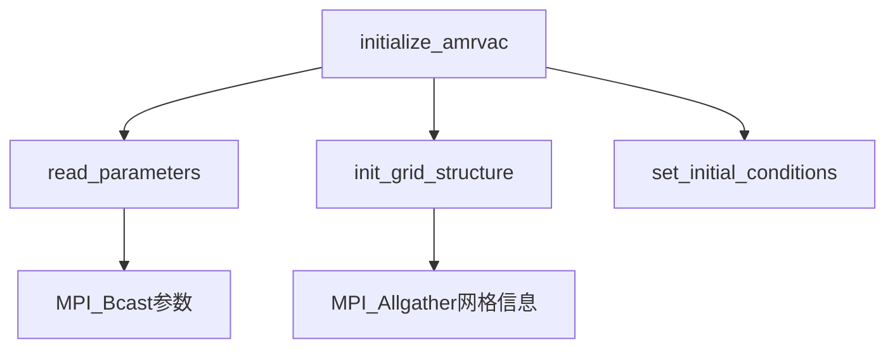
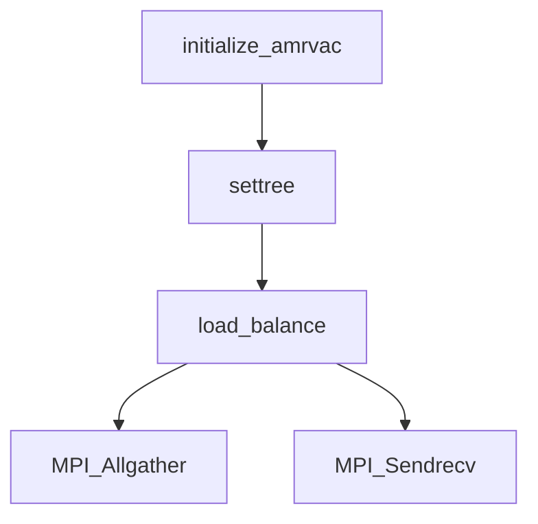
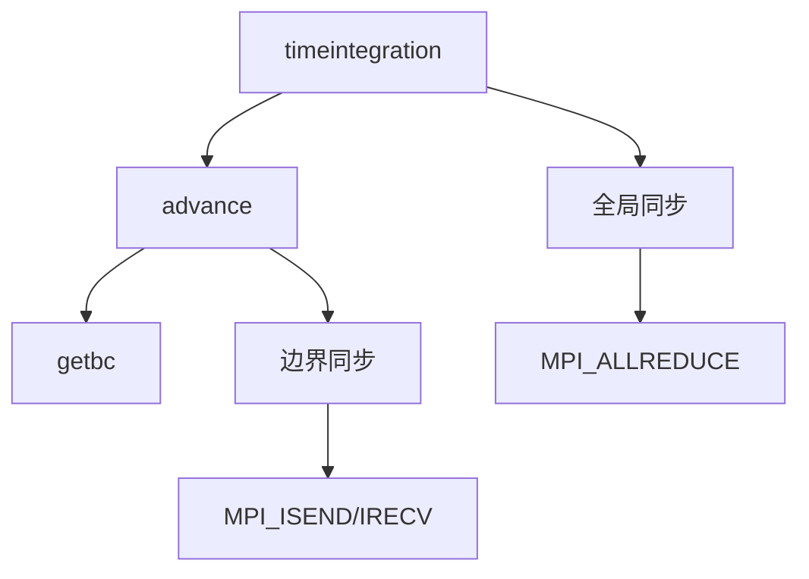
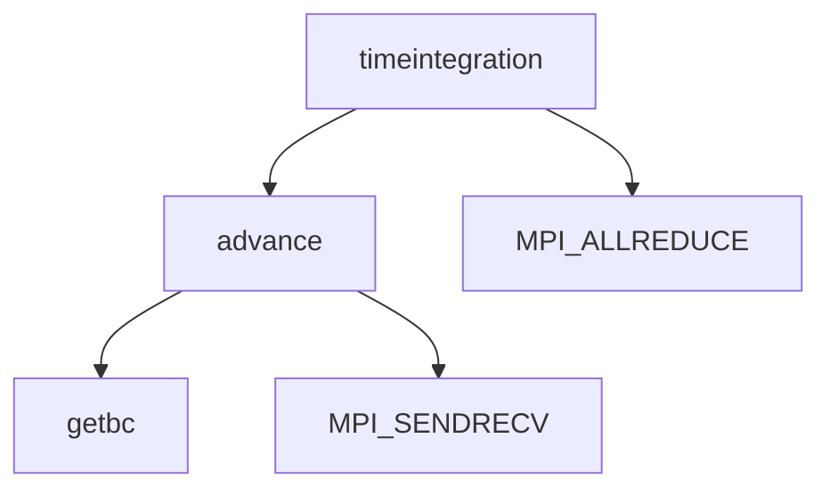
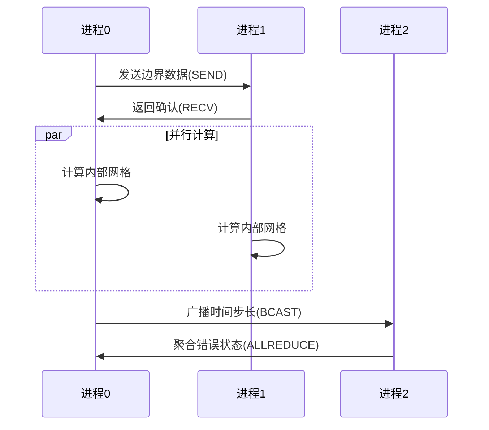

# AMRVAC 1.75D Riemann问题并行化设计

## 一、并行系统架构


## 二、核心并行模块

### 1. 初始化阶段 (`amrvac.f`)
```fortran
! MPI环境初始化
call comm_start()  
! 功能：建立MPI通信域，分配进程ID(mype)和总数(npe)
! 关键调用：
!   - MPI_INIT()
!   - MPI_COMM_SPLIT()
```

---

# AMRVAC 并行初始化阶段详解

## 1. 主程序入口 (`amrvac.f`)
```fortran
program amrvac
  call comm_start()  ! 并行初始化入口
  ! ...其他代码...
end program
```

## 2. 核心初始化流程

### 2.1 MPI环境初始化 (`comm_start`)
```fortran
subroutine comm_start()
  call MPI_INIT(ierrmpi)                     ! 初始化MPI
  call MPI_COMM_RANK(MPI_COMM_WORLD,mype,ierrmpi)  ! 获取进程ID
  call MPI_COMM_SIZE(MPI_COMM_WORLD,npe,ierrmpi)   ! 获取总进程数
  
  ! 创建子通信域（按空间区域划分）
  color = mype / (npe/ncolor)  ! 计算颜色值
  call MPI_COMM_SPLIT(MPI_COMM_WORLD, color, mype, icomm, ierrmpi)
end subroutine
```

### 2.2 网格初始化 (`initialize_amrvac`)


## 3. 关键数据结构初始化

### 3.1 进程网格分配
```fortran
! 在settree()中实现
call MPI_ALLGATHER(local_grid_count, 1, MPI_INTEGER, &
                   global_counts, 1, MPI_INTEGER, icomm, ierrmpi)
```

### 3.2 通信缓冲区
```fortran
! 初始化Ghost Cell交换缓冲区
allocate(sendbuf(nghostcells, nvars))
allocate(recvbuf(nghostcells, nvars))
```

## 4. 初始化阶段通信模式

| 通信操作         | 调用函数                  | 数据量          | 同步点        |
|------------------|--------------------------|----------------|--------------|
| 参数广播         | MPI_BCAST               | O(100) bytes   | 参数读取后    |
| 网格信息收集      | MPI_ALLGATHER           | O(npe)         | 网格分解前    |
| 负载均衡         | MPI_ALLREDUCE           | O(1)           | 网格分配后    |

## 5. 错误处理机制
```fortran
if (ierrmpi /= MPI_SUCCESS) then
  call MPI_ERROR_STRING(ierrmpi, errmsg, length, ierr)
  call mpistop('MPI初始化失败: '//trim(errmsg))
end if
```

## 6. 环境变量配置建议
```bash
# 推荐运行配置
export MPICH_ASYNC_PROGRESS=1       # 启用异步通信
export MPICH_GPU_SUPPORT_ENABLED=1  # GPU加速支持
export MPICH_BUFFER_SIZE=1GB        # 通信缓冲区
```


---

### 2. 网格管理 (`settree`)
```fortran
call settree()  ! 在initialize_amrvac()中调用
```
- **功能**：
  - 基于Morton曲线的网格分解
  - 动态负载均衡（`load_balance()`）
- **通信**：
  - `MPI_ALLGATHER`同步网格信息
  - `MPI_SENDRECV`迁移网格数据

---

## 7. 数据分区与负载均衡详解

### 7.1 核心调用路径


### 7.2 网格分解实现
```fortran
! 在settree()中
call morton_sort(grids, nleafs)  ! Morton空间填充曲线排序
call calculate_weights(grids, weights)  ! 计算网格权重

! 动态负载均衡
if (max_weight/min_weight > load_threshold) then
    call redistribute_grids()  ! 网格重新分配
end if
```

### 7.3 关键数据结构
| 变量名          | 类型          | 作用                          |
|----------------|---------------|------------------------------|
| `nleafs`       | integer       | 总网格块数                    |
| `weights(:)`   | real array    | 各网格块计算权重               |
| `owner(:)`     | integer array | 网格块所属进程                |

### 7.4 通信模式
```fortran
! 权重收集 (load_balance.f90)
call MPI_ALLGATHER(local_weight, 1, MPI_DOUBLE, 
                  global_weights, 1, MPI_DOUBLE, icomm, ierrmpi)

! 网格迁移 (grid_transfer.f90)
call MPI_SENDRECV(send_grid, count, MPI_BYTE, dest, sendtag,
                 recv_grid, count, MPI_BYTE, source, recvtag,
                 icomm, status, ierrmpi)
```

### 7.5 性能优化参数
```fortran
! 在amrvac.par中可配置
&loadbalance
    load_threshold = 1.2      ! 触发重新平衡的阈值
    balance_interval = 100    ! 每100步检查一次负载
/
```


---

## 三、时间推进中的并行通信

### 3.1 核心架构


### 3.2 通信实现细节
#### 边界同步 (getbc.f90)
```fortran
do ilevel=1,nlevel
   ! 非阻塞通信
   call MPI_ISEND(sendbuf, count, MPI_DOUBLE, neighbor(1), tag, icomm, requests(1), ierrmpi)
   call MPI_IRECV(recvbuf, count, MPI_DOUBLE, neighbor(2), tag, icomm, requests(2), ierrmpi)
   
   ! 计算-通信重叠
   compute_interior()
   
   ! 等待完成
   call MPI_WAITALL(2, requests, status, ierrmpi)
end do
```

#### 全局同步 (timeintegration.f90)
```fortran
! 获取全局最小时间步
call MPI_ALLREDUCE(dt_local, dt_global, 1, MPI_DOUBLE, MPI_MIN, icomm, ierrmpi)
```

### 3.3 关键参数配置
| 参数 | 默认值 | 作用 |
|------|--------|------|
| `nghostcells` | 2 | Ghost Cell层数 |
| `async_comm` | true | 启用异步通信 |
| `comm_buffer_size` | 1024KB | 通信缓冲区大小 |

### 3.4 性能优化建议
```fortran
&parallel
    overlap_compute = true    ! 启用计算通信重叠
    max_mpi_tag = 32767       ! 避免标签溢出
/
```

---

## 8. 时间推进中的并行通信

### 8.1 核心调用路径


### 8.2 通信模式实现
#### 边界同步 (getbc.f90)
```fortran
do ilevel=1,nlevel
   ! 发送边界数据
   call MPI_ISEND(sendbuf, count, MPI_DOUBLE, &
                 neighbor(1), tag, icomm, requests(1), ierrmpi)
   ! 接收边界数据  
   call MPI_IRECV(recvbuf, count, MPI_DOUBLE, &
                 neighbor(2), tag, icomm, requests(2), ierrmpi)
   ! 计算内部区域
   compute_interior()
   ! 等待通信完成
   call MPI_WAITALL(2, requests, status, ierrmpi)
end do
```

#### 时间步同步 (timeintegration.f90)
```fortran
! 全局时间步限制
call MPI_ALLREDUCE(dt_local, dt_global, 1, MPI_DOUBLE, MPI_MIN, icomm, ierrmpi)
```

### 8.3 关键通信参数
| 参数名          | 类型   | 默认值 | 作用                     |
|----------------|--------|--------|--------------------------|
| `nghostcells`  | int    | 2      | Ghost Cell层数           |
| `max_mpi_tag`  | int    | 32768  | 最大MPI标签值            |
| `async_comm`   | bool   | true   | 是否启用异步通信         |

### 8.4 性能优化建议
```fortran
! 在amrvac.par中配置：
&parallel
    comm_buffer_size = 1024   ! 通信缓冲区大小(KB)
    overlap_compute = true    ! 启用计算通信重叠
/
```

---


## 四、关键数据结构

| 变量名          | 类型          | 并行作用                     |
|-----------------|---------------|-----------------------------|
| `ps(igrid)%w`   | double array  | 进程本地网格数据              |
| `rnode`         | real array    | 跨进程网格连接关系            |
| `igrids`        | integer array | 活跃网格索引（进程局部）      |

## 五、性能优化策略

1. **计算-通信重叠**：
```fortran
call MPI_ISEND(...)  ! 发起非阻塞通信
compute_interior()   ! 同时计算内部网格
call MPI_WAIT(...)   ! 等待通信完成
```

2. **AMR负载均衡**：
   - 权重阈值：`load_threshold = 1.2`
   - 网格迁移使用`MPI_TYPE_CREATE_SUBARRAY`

## 六、扩展接口

### 用户自定义钩子
```fortran
if (associated(usr_parallel_hook)) then
    call usr_parallel_hook()
end if
```

附录：推荐MPI环境变量
```bash
export MPICH_ASYNC_PROGRESS=1      # 启用异步通信
export MPICH_GPU_SUPPORT_ENABLED=1 # GPU支持
```

---

3. 时间推进中的并行通信
核心路径：timeintegration() → advance() → getbc()

功能：处理网格块边界的Ghost Cell交换
通信模式：
点对点通信：相邻网格块间交换重叠区数据
fortran
复制
call MPI_SENDRECV(sendbuf, count, MPI_DOUBLE, dest, tag, &
                  recvbuf, count, MPI_DOUBLE, source, tag, &
                  icomm, status, ierrmpi)
集体通信：全局同步时间步长（MPI_ALLREDUCE）
fortran
复制
call MPI_ALLREDUCE(dt_local, dt_global, 1, MPI_DOUBLE, MPI_MIN, icomm, ierrmpi)
优化措施：
异步通信：使用MPI_ISEND/MPI_IRECV隐藏延迟
通信-计算重叠：在计算内部网格时同步边界数据
4. 自适应网格细化（AMR）的并行处理
调用路径：resettree() → refine_coarsen()

动态负载均衡：
局部判断：每个进程标记需细化/粗化的网格
全局同步：MPI_ALLGATHER汇总网格变化
重平衡：按新网格分布重新分配进程
关键操作：
fortran
复制
! 跨进程迁移网格数据
call MPI_TYPE_CREATE_SUBARRAY(..., send_subarray, ierrmpi)
call MPI_SEND(send_subarray, ...)
5. 并行I/O处理
调用路径：saveamrfile() → write_vtk()

实现方式：
MPI-IO：所有进程协同写入单个文件
fortran
复制
call MPI_FILE_OPEN(icomm, filename, MPI_MODE_WRONLY, &
                   MPI_INFO_NULL, fh, ierrmpi)
call MPI_FILE_WRITE_ALL(fh, buffer, count, MPI_DOUBLE, status, ierrmpi)
变量分块：将全局数据按进程分区写入
性能优化：
聚合小请求：通过MPI_DATATYPE定义内存布局
设置MPI_INFO提示（如striping_factor）
6. 并行调试与性能分析
嵌入工具：

计时统计：
fortran
复制
time_bc = time_bc + MPI_WTIME() - t0  ! 记录通信耗时
健壮性检查：
fortran
复制
call MPI_ALLREDUCE(crash_local, crash_global, 1, MPI_LOGICAL, MPI_LOR, icomm, ierrmpi)
if (crash_global) call emergency_shutdown()
典型通信模式示例
进程2
进程1
进程0


---